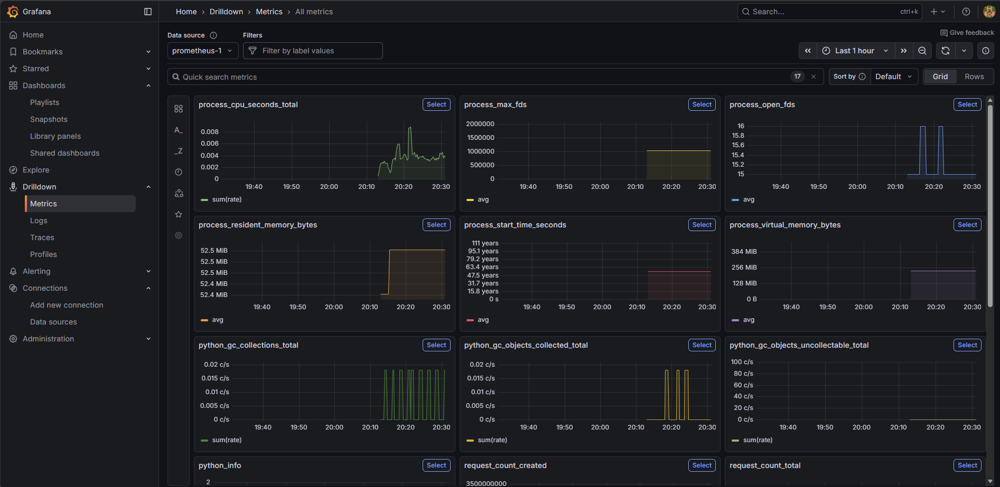
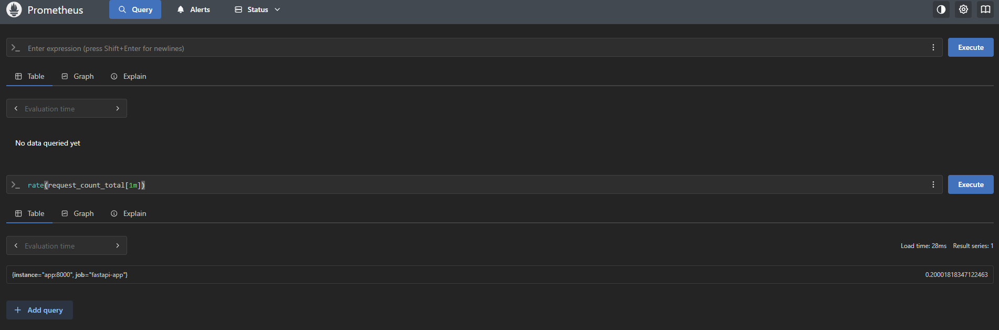

# DevOps Pipeline Project
A complete end-to-end DevOps project demonstrating modern deployment practices using containerized applications, continuous integration, and real-time monitoring. 

This project aims to simulate a production-like environment by building, deploying, and observing a Python-based web service with industry-standard tools.

## Features
### FastAPI Application
- Simple REST API (/)
- Exposes Prometheus metrics at /metrics
- Custom application metric:
  - request_count_total (counts incoming API calls)
- Lightweight & production-ready

### Dockerized Infrastructure
- FastAPI app packaged in a Docker image
- Multi-service architecture orchestrated with Docker Compose

### Prometheus Monitoring
- Automatically scrapes FastAPI metrics
- Stores time-series data
- Provides built-in and custom metrics
- Used as datasource for Grafana

### Grafana Dashboard
- Visualizes application activity
- Custom dashboard panel:
  - Request Per Second (RPS) using:
  rate(request_count_total[1m])

## Technologies Used
- Backend: Python 3.11, FastAPI, Uvicorn
- Containerization: Docker, Docker Compose
- CI/CD: GitLab CI/CD
- Monitoring Stack: Prometheus, Grafana
- Infrastructure: Ubuntu Server 22.04 (VirtualBox VM)

Optional Tools:
- NGINX reverse proxy
- systemd for long-running services
- SSH for remote deployment automation

## Architecture
                ┌────────────────────┐
                │      Browser       │
                │ (User Requests)    │
                └─────────┬──────────┘
                          │
                ┌─────────▼──────────┐
                │    FastAPI App     │
                │  (Docker Container)│
                └───────┬────────────┘
                        │ exposes /metrics
                ┌───────▼───────────┐
                │    Prometheus     │
                │  (scrapes metrics)│
                └───────┬───────────┘
                        │ datasource
                ┌───────▼─────────────┐
                │      Grafana        │
                │  (Dashboards)       │
                └─────────────────────┘


## Installation and Setup
### 1. Clone the Repository
git clone https://github.com/username/devops-python-docker-ci-monitoring
cd devops-python-docker-ci-monitoring

### 2. Local Development (Optional for Now)
To run the full stack locally:
docker compose up --build

### 3. VM Setup (In Progress)
A VirtualBox Ubuntu Server VM will be used as the deployment target.
Setup steps include:
- Installing Docker & Docker Compose
- Configuring SSH access
- Pulling images from registry
- Running the application via docker compose

## Project structure
```bash
/app
  main.py              → FastAPI application
  exporter.py          → Prometheus metrics
  Dockerfile           → Application container build
  requirements.txt     → Python dependencies

/prometheus
  prometheus.yml       → Scrape configuration

/grafana
  provisioning/
    dashboards/
      dashboard.json   → Initial Grafana dashboard

docker-compose.yml     → Local + production stack
.gitlab-ci.yml         → GitLab CI/CD pipeline
README.md              → Project documentation
```

## Deployment

### Local Deployment
```bash
docker compose up -d --build
```

Services will be accessible at:
- API: http://localhost:8000
- Metrics: http://localhost:8000/metrics
- Prometheus: http://localhost:9090
- Grafana: http://localhost:3000

### VM Deployment (Upcoming)
1. Push code to GitHub
2. GitHub Actions runs:
- test
- build Docker image
- push to GitHub Container Registry (GHCR)
- deploy to VM via SSH
3. Docker Compose restarts the service on the VM

## Monitoring Overview
- /metrics endpoint exposes custom metrics (request count, latency, uptime)
- Prometheus scrapes metrics at 5s intervals
- Grafana visualizes application health on a dashboard
- Additional panels planned:
  - Container CPU / Memory
  - Request duration
  - Status code distribution

## Installation & Usage
### 1. Clone the repository
```bash
git clone https://github.com/albx/devops-observability-pipeline.git
cd devops-observability-pipeline
```

### 2. Start the full monitoring stack
```bash
docker compose up --build
```

This starts:

| Service      | URL                         | Description                       |
|--------------|------------------------------|-----------------------------------|
| FastAPI      | http://localhost:8000        | Root API endpoint                 |
| Metrics      | http://localhost:8000/metrics | Prometheus metrics exposition     |
| Prometheus   | http://localhost:9090        | Query UI (PromQL)                 |
| Grafana      | http://localhost:3000        | Dashboards (admin / admin)        |


Grafana login (default):
User: admin
Pass: admin
You’ll be prompted to set a new password.

## Screenshots
### Grafana Dashboard

### Prometheus query table

### Prometheus query graph


## Local Testing
Trigger some test traffic:
```bash
curl http://localhost:8000/
curl http://localhost:8000/
```
Then check:

```bash
curl http://localhost:8000/metrics | grep request
```
